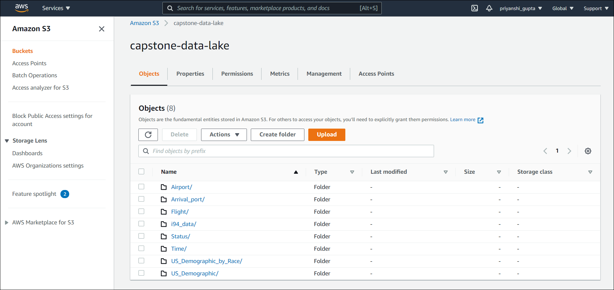
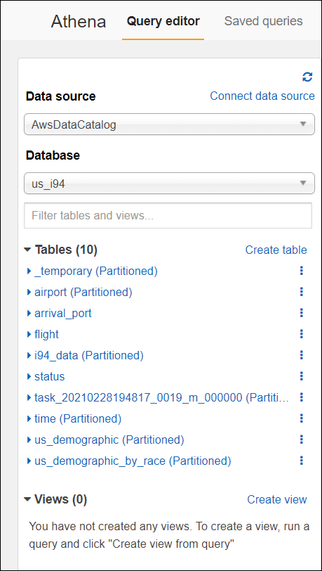
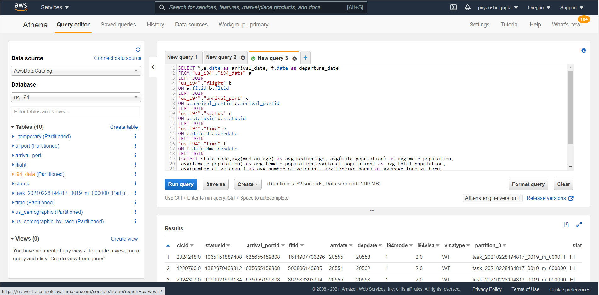
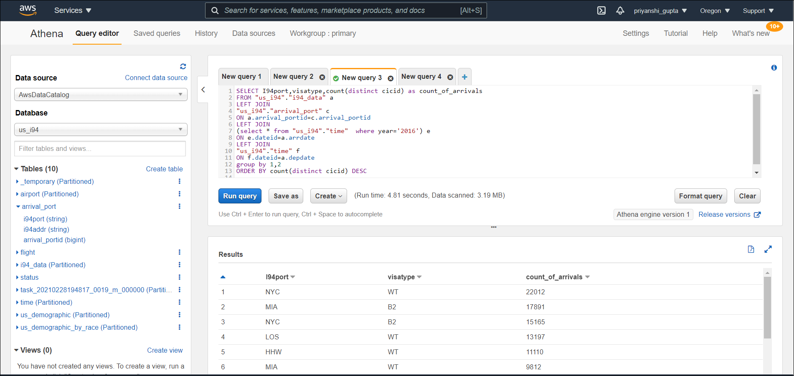
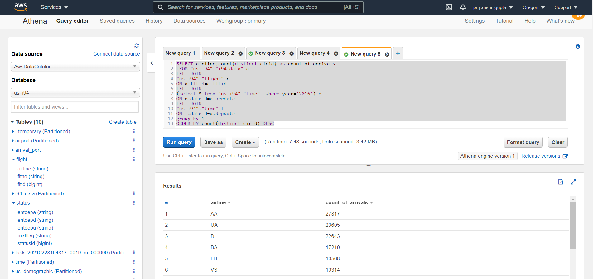
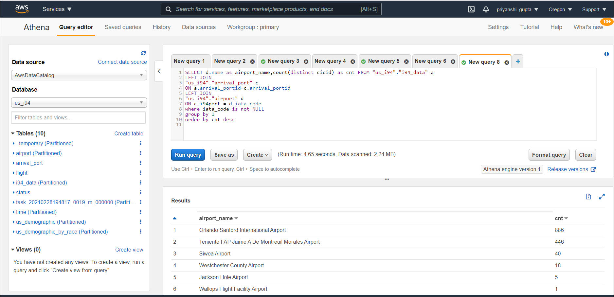

# Analysing-US-Immigration-Data-using-AWS-EMR-and-AWS-Athena

## Data Model

## Scope the Project and Gather Data

Following are the datasets used for this project: 

#### Immigration Data
“Form I-94, the Arrival-Departure Record Card, is a form used by the U.S. Customs and BorderProtection (CBP) intended to keep track of the arrival and departure to/from the United States ofpeople who are not United States citizens or lawful permanent residents (with the exception of thosewho are entering using the Visa Waiver Program or Compact of Free Association, using BorderCrossing Cards, re-entering via automatic visa revalidation, or entering temporarily as crewmembers)” (
https://en.wikipedia.org/wiki/Form_I-94
) .It lists the traveler’s immigration category, portof entry, data of entry into the United States, status expiration date and had a unique 11-digitidentifying number assigned to it. Its purpose was to record the traveler’s lawful admission to theUnited States (
https://i94.cbp.dhs.gov/I94/(
This is the main dataset and there is a file for each month of the year of 2016 available in thedirectory ../../data/18-83510-I94-Data-2016/ . It is in SAS binary database storage format sas7bdat.This project uses the parquet files available in the workspace and the folder called sap_data. Thedata is for the month of the month of April of 2016 which has more than three million records(3.096.313). The fact table is derived from this table.

#### Airports Data
“Airport data includes IATA airport code.An IATA airport code, also known as an IATA locationidentifier, IATA station code or simply a location identifier, is a three-letter geocode designatingmany airports and metropolitan areas around the world, defined by the International Air TransportAssociation (IATA). IATA code is used in passenger reservation, ticketing and baggage-handlingsystems (
https://en.wikipedia.org/wiki/IATA_airport_code)”
. It was downloaded from a public domainsource (
http://ourairports.com/data/
)

#### U.S. City Demographic Data
This dataset contains information about the demographics of all US cities and census-designatedplaces with a population greater or equal to 65,000. This data comes from the US Census Bureau’s2015 American Community Survey. This product uses the Census Bureau Data API but is notendorsed or certified by the Census Bureau. The US City Demographics is the source of the STATEdimension in the data model and grouped by State.

* This data was transfered to the S3 bucket to make dimensional modelling easy.

## Explore and Assess the Data

1) i94 data had missing values, these columns were dropped.
2) Demographic dataset contains data for 48 states and doesnot have many missing values.
3) Most of the iata_code are missing but using it, we can get airports information of immigrants.
4) Drooped duplicate values from all dimensions as well as facts.
5) Grouped the data to provide an aggregated statistics per US state.
6) Renamed the columns of the dataset to more meaning full names.

## Define the Data Model

Used Star schema to do the dimensional modeling for this project. I-94 data was used as Fact table which was connecting to other dimensions by refering to their primary key.
This choice med it easy for my to analyse and gather more information pertaining to th ei94 data.

### Data Model

Fact Table:

- I94_Fact -Contains fact about immigration in US
  `cicid`, `statusid`, `arrival_portid`, `fltid`, `arrdate`, `depdate`, `i94mode`, `i94visa` , `visatype` 
  
Dimension Tables:

- Flight - Flight information 
  `airline` ,`fltno` ,`fltid` 
- Status - Information about  Arrival Flag  ,  Update Flag , Match flag
  `entdepa` ,`entdepd`,`entdepu`,`matflag` ,`statusid` 
- Time - Details about specific date
  `dateid` ,`date`,`month` ,`day` ,`weekday` ,`weeek_num` 
- Airport - Information about airports
  `ident` ,`type` ,`iata_code` ,`name` ,`iso_country`,`municipality` ,`gps_code` 
- Arrival_port- Information about immigrants arrival port.
  `i94port` ,`i94addr` ,`arrival_portid` 
- US_demographic: Information about cities in each city with demographic information.
  `city` ,`median_age`,`male_population` ,`female_population` ,`total_population` ,`number_of_veterans` ,`foreign_born` ,`average_household_size` ,`state_code` 
- US_demographic_race: Information about cities in each city with demographic information by race.
  `city` ,`race` ,`count` 
  
I will be using AWS services to build an ETL pipeline to_build a data lake hosted on S3 location "s3a://capstone-data-lake/"

## Mapping Out Data Pipelines

Following are the steps included in the pipeline:

1) Load the data in S3 Bucket to integrate all the sources.
2) Use AWS EMR with configured Hadoop and Spark to build the dimenstional model.
3) Dump the dimensional model as partitioned parquet files in a Data Lake for effecient storage.
4) Use AWS Glue to create a crawler to infer schema and get data to make it available for us to query.
5) Use AWS Athena to analyse the data by quering from the cube.

## Process to Execute 

### 1.Create IAM Role on AWS

By accessing AWS Identity and Access Management (IAM) console, create a user with additional policies of AmazonS3FullAccess, AmazonEC2FullAccess and AdministratorAccess.Save the key and secret id.

### 2.Add the credentials to the Config file

Add the secret key and id into the config file "dl.cfg".

### 3.Create Key pair on EC2 machine.

I needed to create one SSH key pair to securely connect to the EMR cluster that I create.

### 4.Create EMR Cluster

Created an EMR cluster by using Infrasture as code methodology "InfraCode.py".
We can also craete it by access the AWS EMR console. 
Note: I created a cluster with 1 master node and 6 core, while creating the cluster I made sure to add spark application.

You can also login into AWS EMR console and verify the cluster is in the RUNNING or WAITING mode:

### 5.Import the executable files to HDFS

Connect to the EMR cluster with SSH and import the files to be executed on HDFS.

Below is the screen shot for your reference:

You can also check the HDFS browser by accessing the HDFS Namenode url.
Below is the screen shot for your reference:

Further you can submit the spark script in YARN mode by command:

/user/bin/spark-submit --master yarn ./etl.py

### 6.Monitor job

The job and stages will appear in the Spark History Server UI.
We can also monitor the Spark executors.

### Data Lake

Each of the tables were written to parquet files in a separate analytics directory on S3. Each table has its own folder within the directory. 

## Analysis with Amazon Athena

After running the pipeline, we can do some analysis by ingesting the S3 data using Amazon Athena

First, setup a Glue crawler that points to the bucket folder where the generated tables files are stored. The crawler will automatically extract the tables from the parquet files.

After a few minutes, tables will show up in the Athena console under Query Editor:

- Following is the cube query we can use for the data analysis:

~~~sql
SELECT *,e.date as arrival_date, f.date as departure_date 
FROM "us_i94"."i94_data" a
LEFT JOIN
"us_i94"."flight" b
ON a.fltid=b.fltid
LEFT JOIN
"us_i94"."arrival_port" c
ON a.arrival_portid=c.arrival_portid
LEFT JOIN
"us_i94"."status" d
ON a.statusid=d.statusid
LEFT JOIN
"us_i94"."time" e
ON e.dateid=a.arrdate
LEFT JOIN
"us_i94"."time" f
ON f.dateid=a.depdate
LEFT JOIN
(select state_code,avg(median_age) as avg_median_age, avg(male_population) as avg_male_population,
 avg(female_population) as avg_female_population,avg(total_population) as avg_total_population,
 avg(number_of_veterans) as avg_number_of_veterans, avg(foreign_born) as average_foreign_born,
 avg(average_household_size) as average_household_size from
 "us_i94"."us_demographic" group by state_code) g
ON g.state_code=a.state_code
~~~

- Following is the query to analyse the number of immigrants arriving at each port and visatype for year 2016.

~~~sql
SELECT I94port,visatype,count(distinct cicid) as count_of_arrivals
FROM "us_i94"."i94_data" a
LEFT JOIN
"us_i94"."arrival_port" c
ON a.arrival_portid=c.arrival_portid
LEFT JOIN
(select * from "us_i94"."time"  where year='2016') e
ON e.dateid=a.arrdate
LEFT JOIN
"us_i94"."time" f
ON f.dateid=a.depdate
group by 1,2
ORDER BY count(distinct cicid) DESC
~~~~

- Following is the query to analyse the number of immigrants arriving via each airline for year 2016.

~~~sql
SELECT airline,count(distinct cicid) as count_of_arrivals
FROM "us_i94"."i94_data" a
LEFT JOIN
"us_i94"."flight" c
ON a.fltid=c.fltid
LEFT JOIN
(select * from "us_i94"."time"  where year='2016') e
ON e.dateid=a.arrdate
LEFT JOIN
"us_i94"."time" f
ON f.dateid=a.depdate
group by 1
ORDER BY count(distinct cicid) DESC
~~~~

- Following is the query to analyse the number of immigrants arriving for each airport for year 2016.

~~~sql
SELECT d.name as airport_name,count(distinct cicid) as cnt FROM "us_i94"."i94_data" a
LEFT JOIN
"us_i94"."arrival_port" c
ON a.arrival_portid=c.arrival_portid
LEFT JOIN
"us_i94"."airport" d
ON c.i94port = d.iata_code
where iata_code is not NULL
group by 1
order by cnt desc
~~~~

